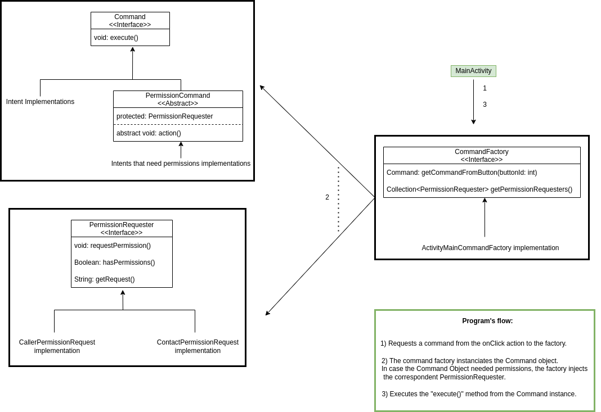

# Activity #3 for the Android course

## Added features
This project is an "improvement" from the original repository: https://github.com/msendin/IntentsImplicits
The added features are:
  * Translated the java code to kotlin.
  * Applied design patterns such as factory, command and template, for a better readability/scalability of the code
  * Usage of android bindings instead of the nearly deprecated findViewById

## Program flow/architecture
This diagram shows the different modules that we can found on the project, as well as the usual flow of the program and how it affects the different components.

